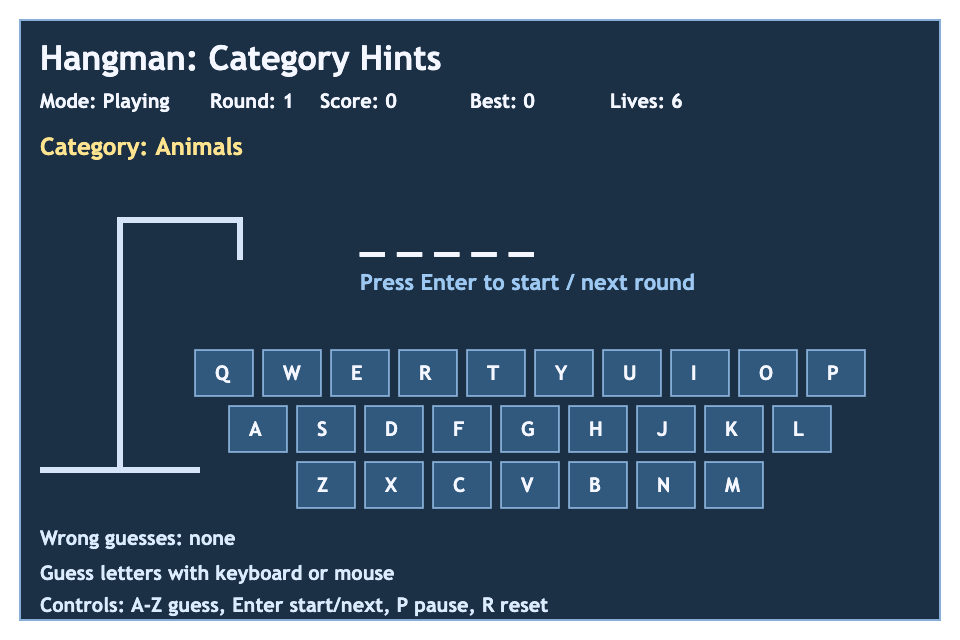
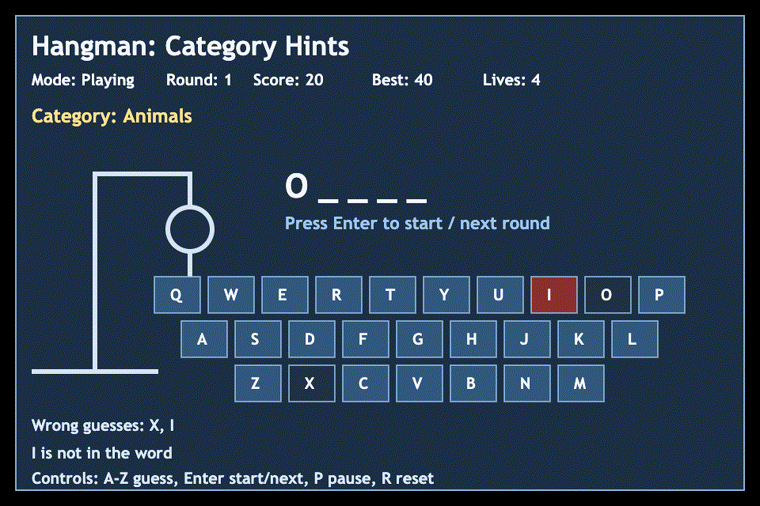

# daily-classic-game-2026-02-25-hangman-category-hints

<div align="center">
  <p><strong>Decode the hidden word before the gallows completes, guided by category hints.</strong></p>
</div>

<div align="center">
  
</div>

<div align="center">
  
</div>

## Quick Start

```bash
pnpm install
pnpm dev
```

## How To Play
- Press `Enter` to start a round.
- Read the category hint and guess letters with keyboard (`A-Z`) or mouse clicks.
- Press `P` to pause/resume.
- Press `R` to reset the run.
- After win/loss, press `Enter` for the next round.

## Rules
- You get 6 wrong guesses per round.
- Repeated letter guesses do not consume lives.
- Correct guesses reveal all matching letters.
- The round ends immediately when the word is solved or all lives are lost.

## Scoring
- Correct letter: `+40` per revealed letter instance.
- Wrong letter: `-10` (floored at 0).
- Win bonus: `(lives_remaining * 25) + (unique_letters * 10)`.
- `Best` tracks the highest score in-session.

## Twist
Each round includes a visible category hint (for example Animals, Space, or Music), enabling strategic letter choices and faster solves.

## Verification

```bash
pnpm test
pnpm build
node "$CODEX_HOME/skills/develop-web-game/scripts/web_game_playwright_client.js" \
  --url "http://127.0.0.1:4173" \
  --actions-file playwright/actions/main-actions.json \
  --output-dir playwright/main-actions
```

## Project Layout
- `index.html`: App bootstrap and canvas mount.
- `src/game.js`: Deterministic game rules, scoring, and snapshot model.
- `src/main.js`: Render loop, keyboard/mouse controls, and hooks exposure.
- `scripts/self_check.mjs`: Deterministic logic checks.
- `docs/plans/`: Run-specific implementation planning docs.
- `assets/images/` and `assets/gifs/`: README media artifacts.

## GIF Captures
- Opening board: `assets/gifs/clip-1-opening.gif`
- Mid-round guesses: `assets/gifs/clip-2-mid-round.gif`
- End-state reveal: `assets/gifs/clip-3-end-state.gif`
